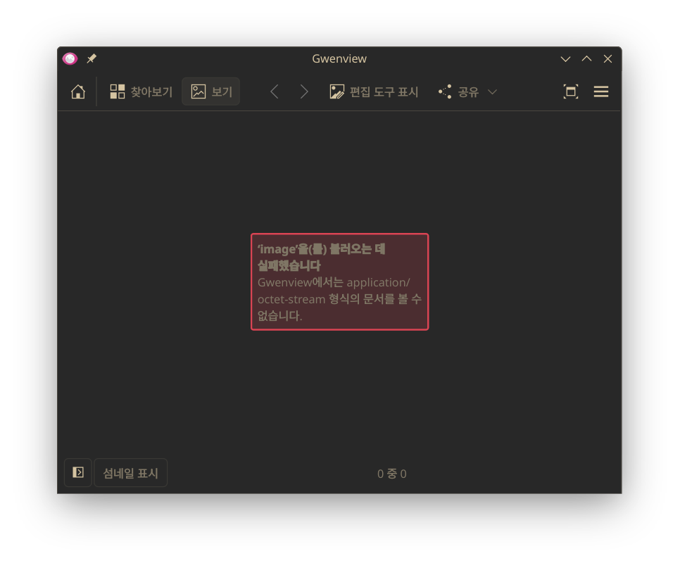
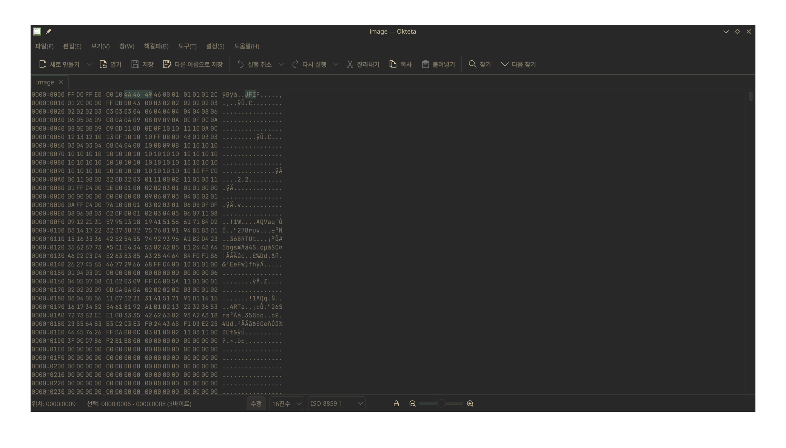
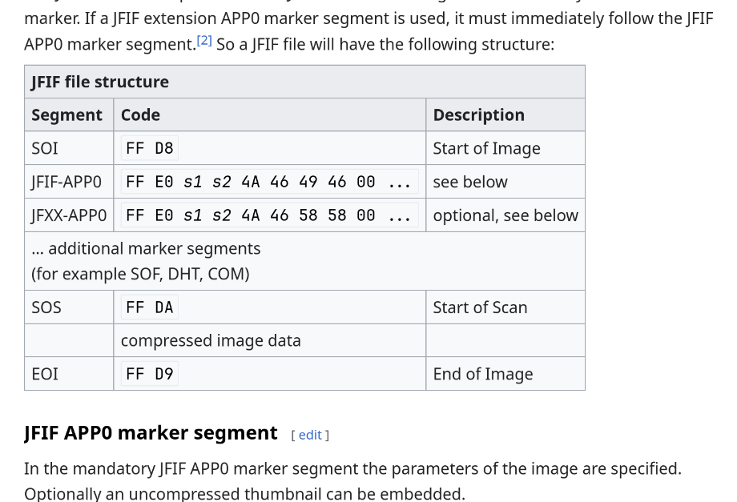
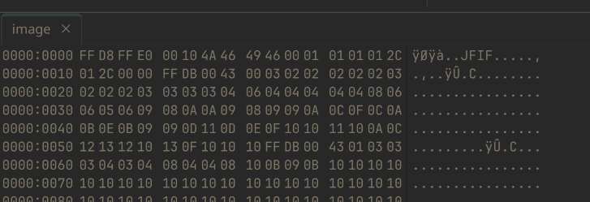
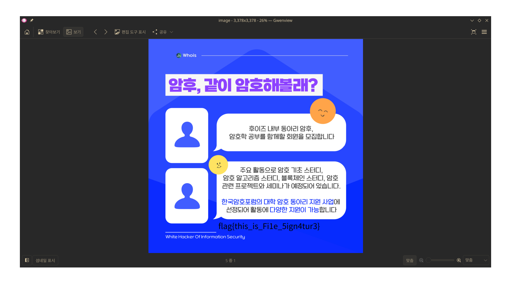

# Forensic 2 - Modified file - 설규원

팀 이름: 넌root일때가젤멋져

이미지가 손상되어 보여서 복구하기 위해 Hex editor인 Okteta로 열어보았다.

잘 보니 `JFIF`가 보인다. 따라서 인터넷에서 JFIF에 맞는 헤더 형식을 찾아보았다.

위키피디아에 따르면 올바른 헤더 형식은 `FF D8`로 시작한다.

그러나 해당 파일은 `FF D0`이므로, 이를 고쳐줘야 한다.

저장하자마자 이미지가 제대로 고쳐진 것을 알 수 있다. 이 이미지 아래에 플래그가 있다.
