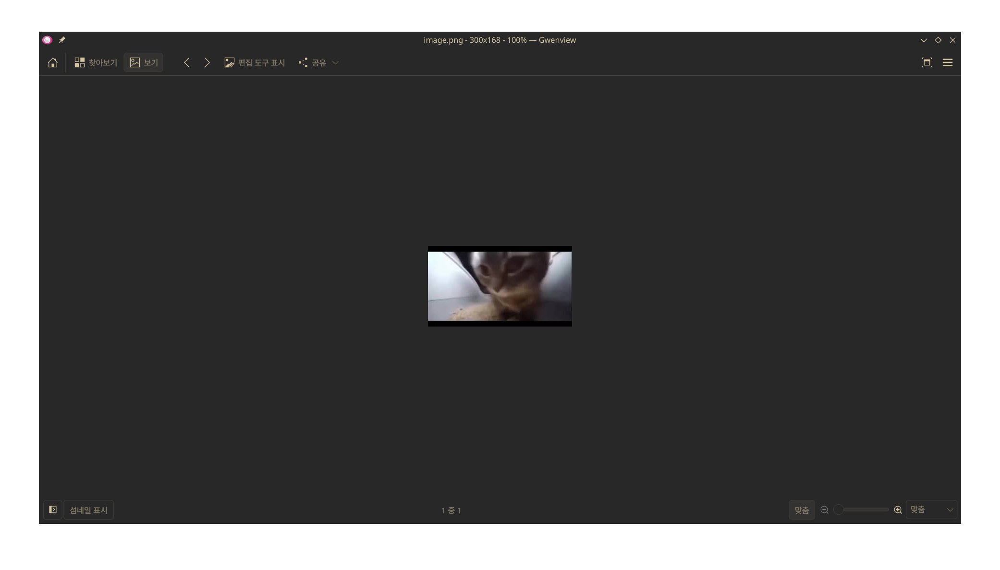

# Forensic 3 - Stegano - 설규원

이미지는 그저 평범해 보인다. 문제의 제목의 `Stegano`를 보고 이미지에 숨겨진 정보가 있을 것이라고 생각했다. 그래서 스테가노그래피 툴을 이용해 사진을 분석해보았다.

[온라인 스테가노그래피 툴](https://stylesuxx.github.io/steganography/)을 이용해 이미지를 분석해보았다. `Decode` 버튼을 눌러보니 플래그가 나왔다.
