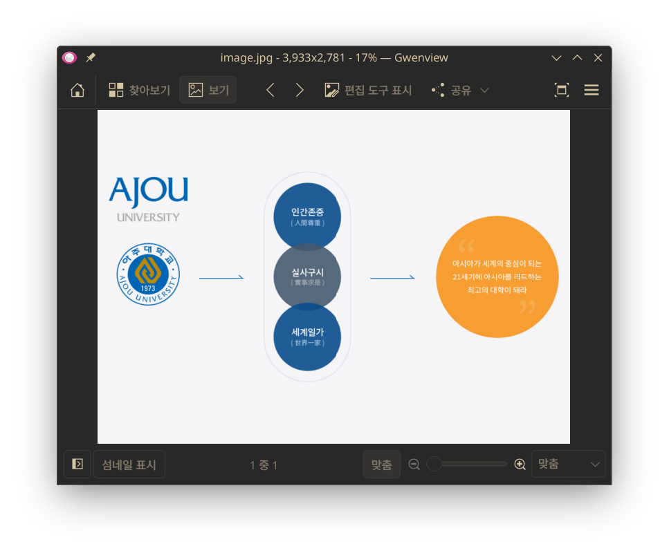
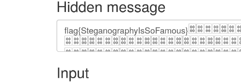
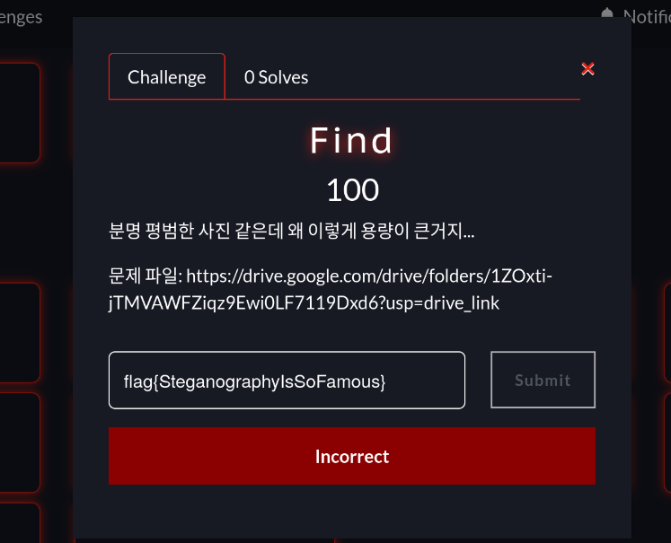
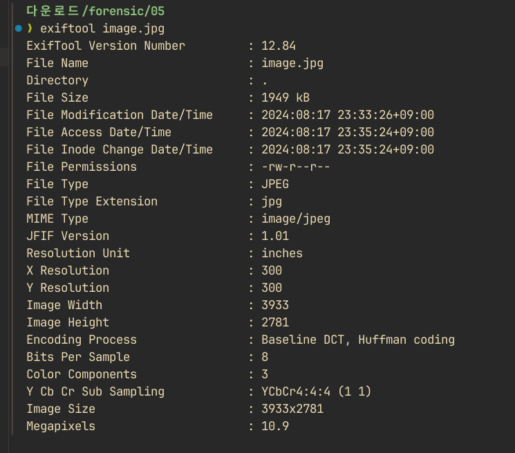
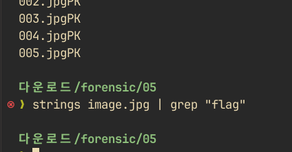
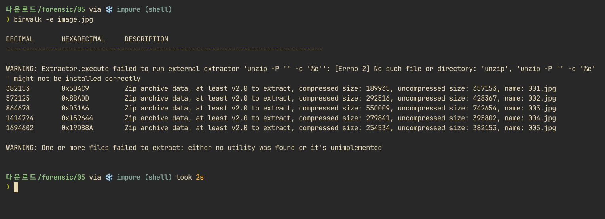
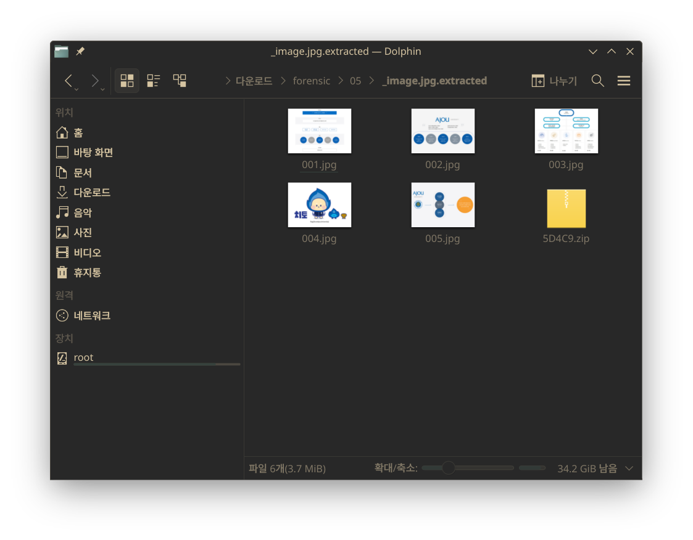
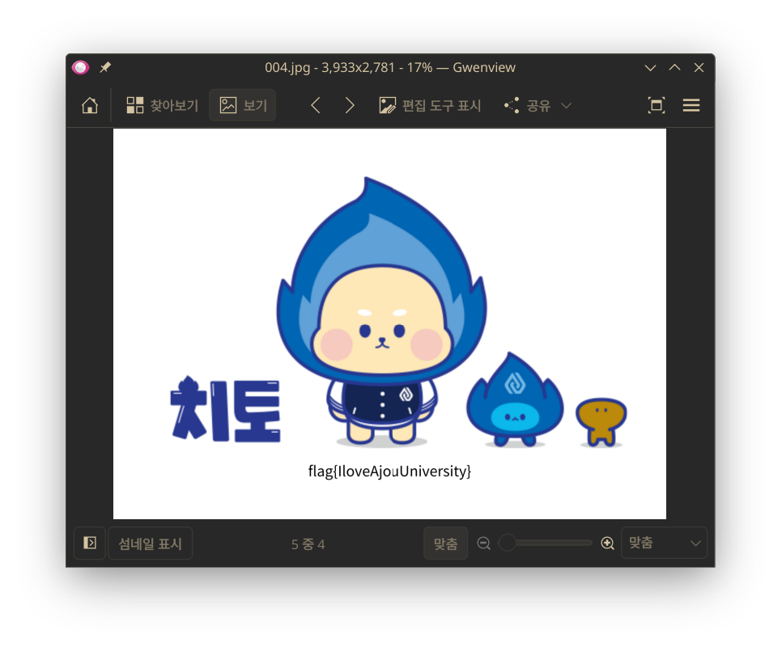

# Forensic 05 - Find

우선 사진은 평범해 보였다. 숨겨진 정보가 없을까 싶어 [온라인 스테가노그래피 툴](https://stylesuxx.github.io/steganography/)을 사용해 보았다.

그랬더니 다음과 같은 플래그가 나왔다.

그러나, 이는 정답이 아니었다.

이미지 코멘트에 플래그가 숨겨져있을까 해서 exiftool로 분석해보았지만 아무것도 없었다.

strings로 문자열을 검색해보았지만 이 경우에도 플래그는 없었다.

그러던 중, 파일이 유독 큰 것을 의심해 binwalk로 숨겨진 내부 파일이 있는지 찾아보았다.

binwalk로 추출했더니, 기존 사진과 다른 파일들이 나타났다.

그 중 네번째 사진에서 진짜 플래그를 찾을 수 있었다.
