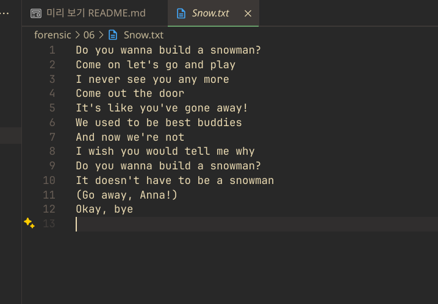
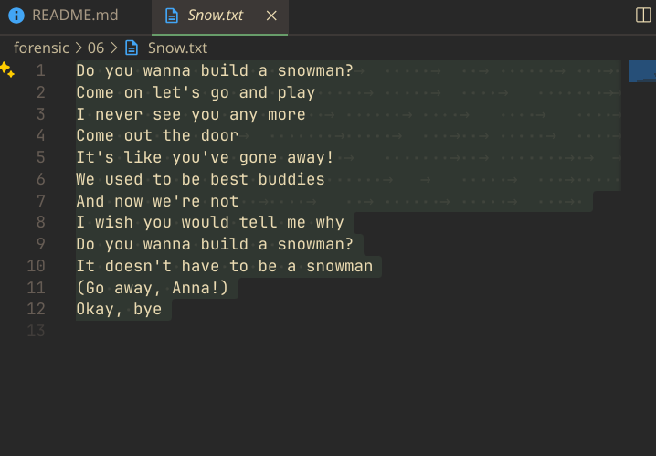
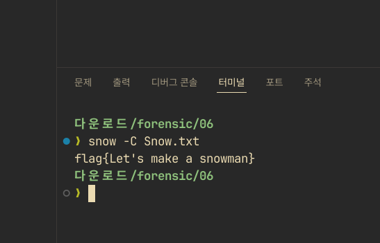

# Forensic 06 - Snowman - 설규원

해당 txt는 그냥 보았을 때는 아무런 문제가 없어보인다. 그러나 문제의 내용을 보면, `하얀 공간`을 언급하고 있다. 이것이 whitespace를 의미하는 것이라고 생각하고, vscode로 선택해보았다.

예상했던 대로, whitespace들이 숨어있었다. whitespace를 사용하는 스테가노그래피 툴은 `SNOW`가 대표적이므로, 이를 사용해 복호화를 시도해보았다.

그러자 flag가 바로 나타났다.
