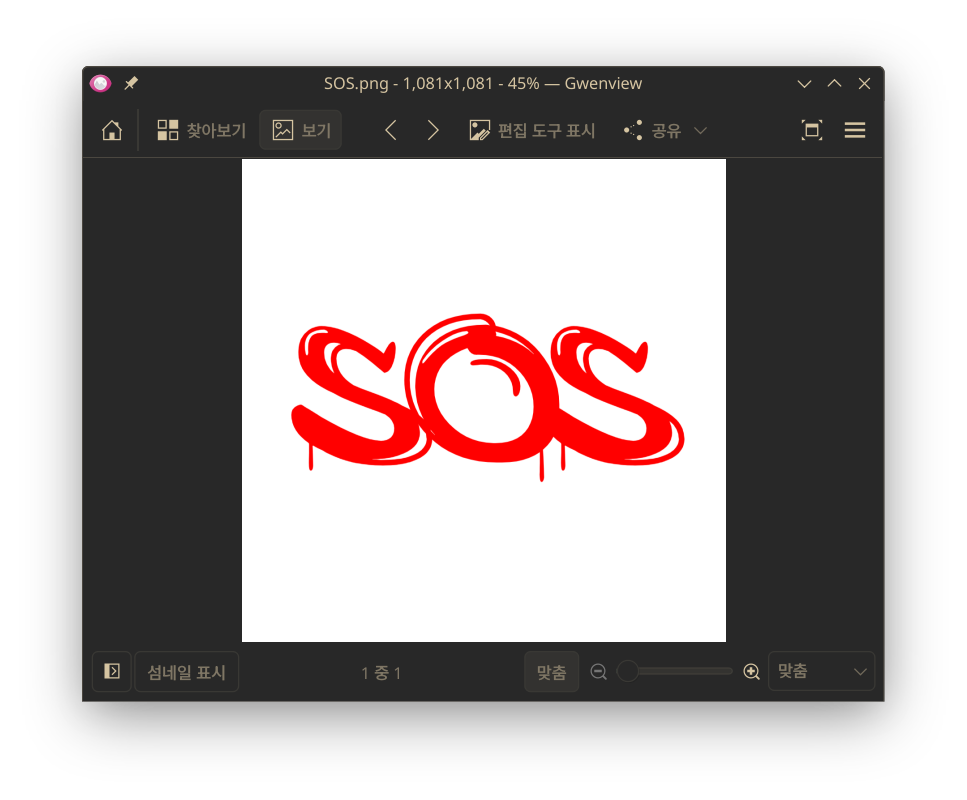
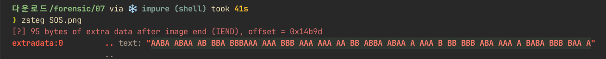
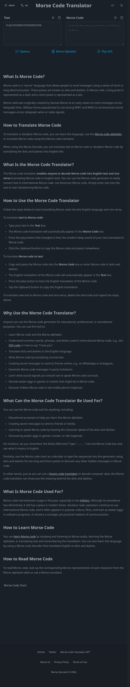

# Forensic 07 - SOS - 설규원

이번에도 마찬가지로 이미지는 평범해 보였다. 이것저것 해봐도 나오는 게 없다가,

zsteg를 했더니, A와 B로만 이루어진 문자열이 나왔다.

SOS는 **모스 부호가 유명하다**.

그 힌트를 받고, `A`를 `.`으로, `B`를 `-`로 치환하니,

`..-. .-.. .- --. ---... ... --- ... ... .. -- .--. .-.. . ... - -- --- .-. ... . -.-. --- -.. .`가 되었다.

이를 모스 변환기에 넣으니,

다음과 같이 답이 나왔다.
