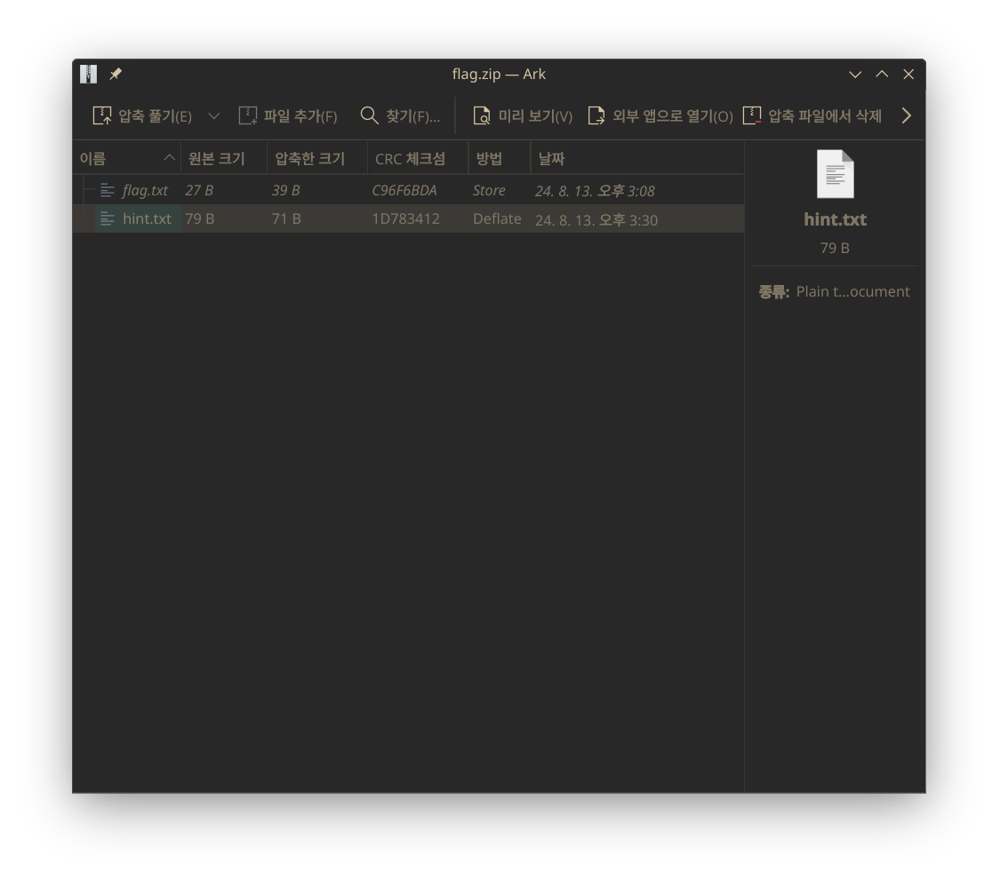
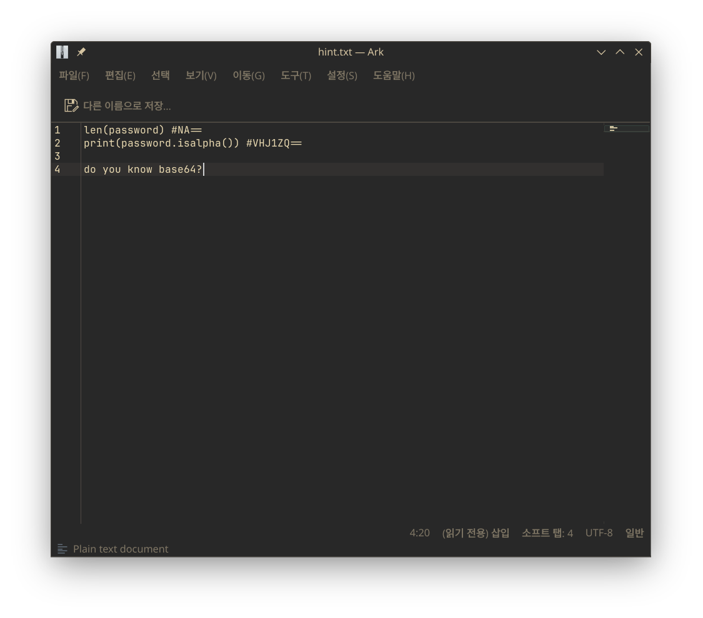
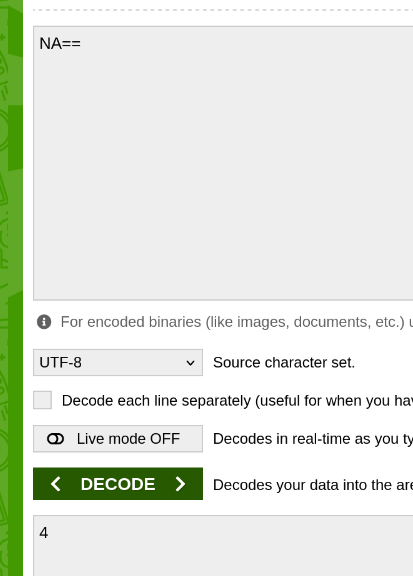
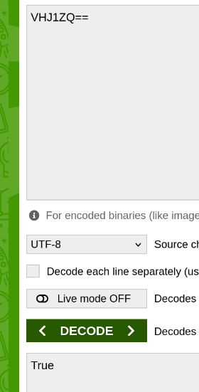
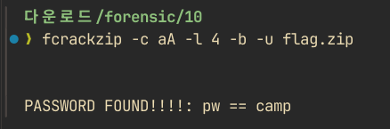
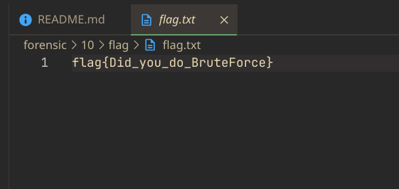

# Forensic 10 - Solve me - 설규원

팀 이름: 넌root일때가젤멋져

flag.txt만 암호화된 zip 파일이다.

hint.txt에 힌트가 적혀있다. #으로 시작하는 부분을 base64로 디코딩하면 될 것 같다.

두 값은 4와 True였다. 따라서, 패스워드의 길이는 4이고, 모두 알파벳이다. 브루트포싱을 할 수 있을 것 같다.

fcrackzip 툴을 이용해 브루트포싱하였다. 문자는 알파벳 소문자/대문자, 길이는 4, unzip 메소드로 실행하였더니 패스워드가 `camp`인 것을 알 수 있었다.

해당 비밀번호로 unzip해보니 flag를 얻을 수 있었다.
