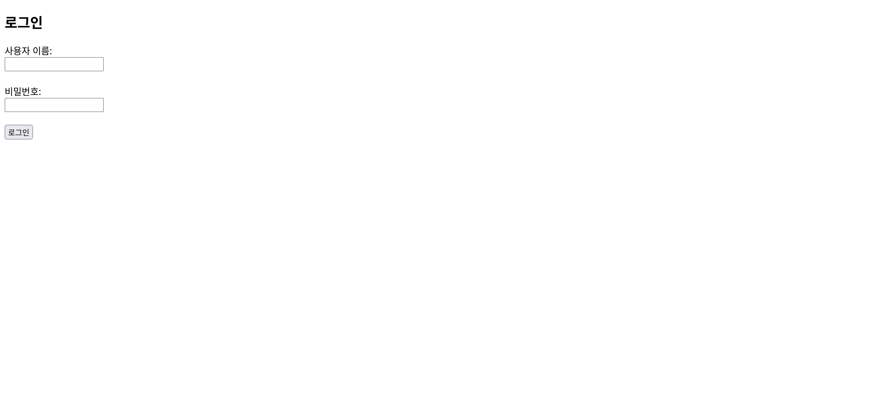
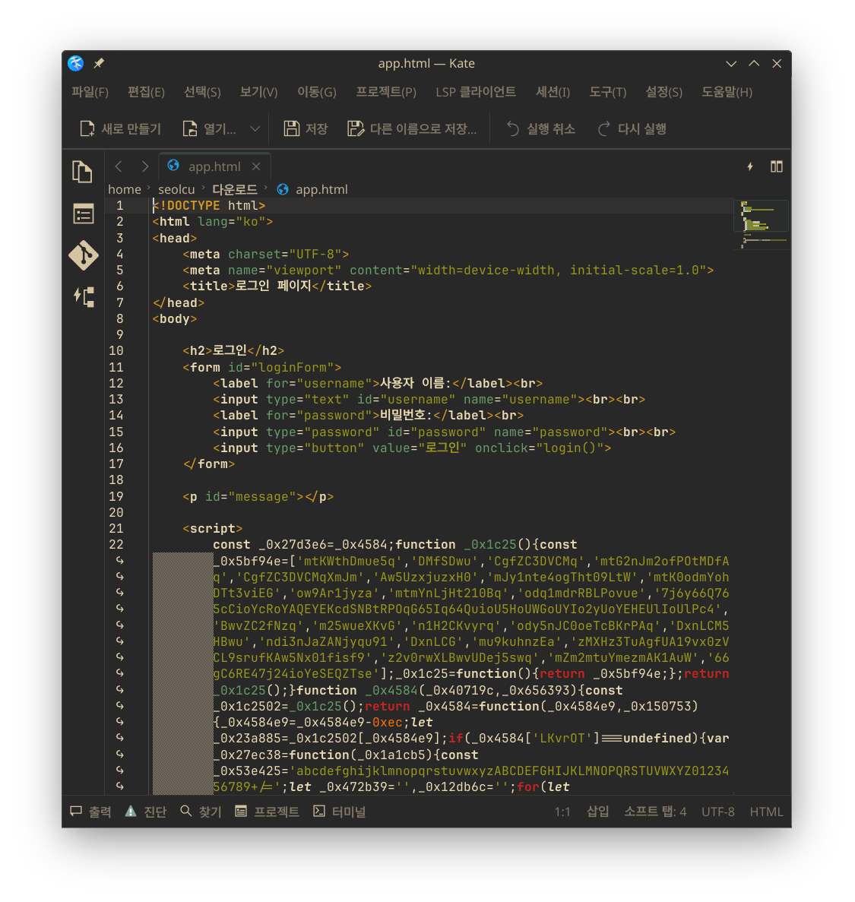
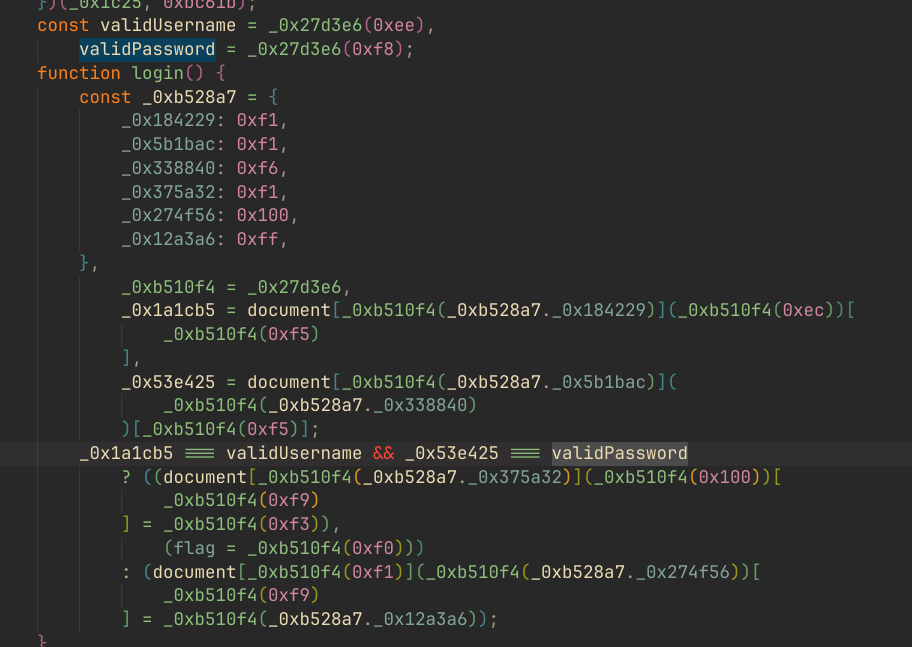
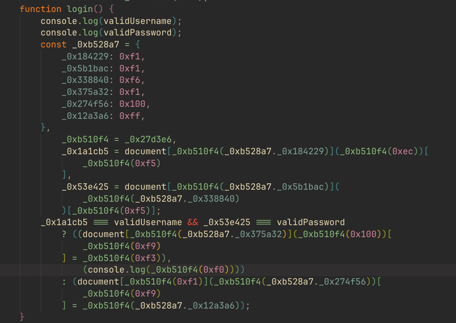
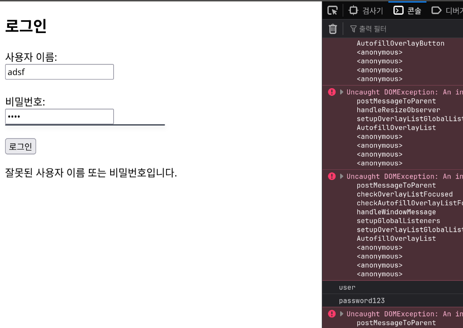
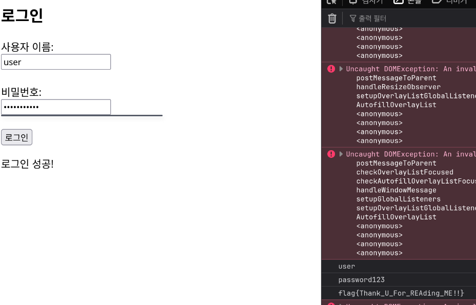

# Misc 07 - Can't Read

제공된 html 파일은 위와 같이 로그인 창이 있다.

그리고 자바스크립트 부분은 다음과 같이 난독화되어있다. VSCode의 Prettier 플러그인으로 예쁘게 정렬해보자.

`validUsername`과 `validPassword`가 맞으면, flag를 생성해내는 코드인 것 같다.

그러면, `console.log`로 `validUsername`과 `validPassword`를 출력하게 하자. 조건이 맞으면 flag 또한 출력되도록 한다.

아무거나 쳐서 login 버튼을 눌렀을 때, 진짜 username과 password를 알 수 있다.

user와 password123을 입력하니, 정확한 flag가 출력되었다.
