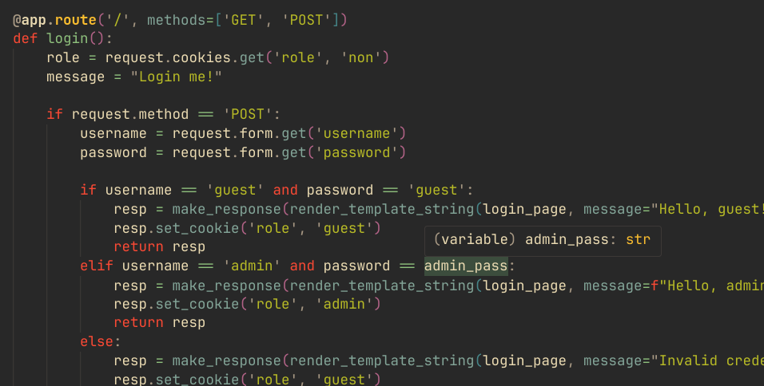
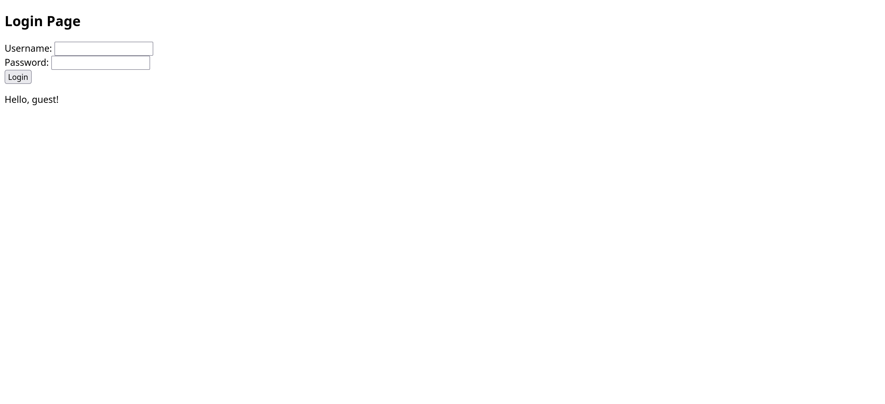
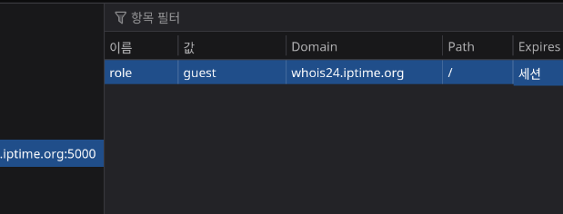
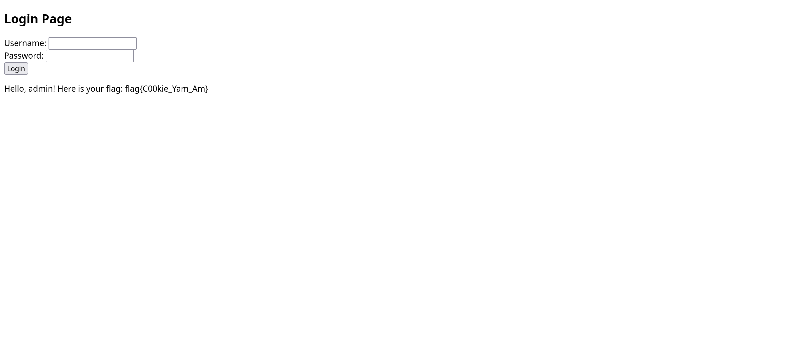

# Web 02 - 내가 만든 쿠키~~ - 설규원

다음과 같은 웹페이지다. 이름과 같이, 쿠키를 조작해 어드민으로 로그인해야 할 것 같다.

첨부된 app.py는 flask 서버 파일이다. 코드를 보아하니, 아이디 guest, 비밀번호도 guest인 것 같다.

정말 다음과 같이 guest로 로그인 되었다. 그러니, 쿠키를 확인해본다.

`role`쿠키가 `guest`로 설정되어 있다. 이를 `admin`으로 조작하면,

admin으로 로그인되어 다음과 같이 flag를 얻을 수 있다.
