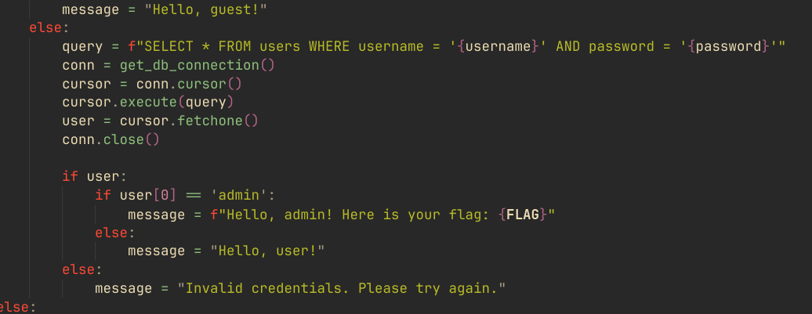
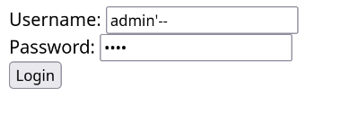

# Web 03 - Login - 설규원

로그인 페이지이다. admin으로 로그인하면 되는 문제인 것 같다.

app.py에 다음과 같은 쿼리가 보인다. 이 쿼리를 보면, username값을 아무런 검사 없이 받는다. 따라서, 주석 처리를 통해 password 검사를 패스할 수 있을 것 같다.

따옴표로 쿼리문을 끝내고, 뒷부분을 `--`를 통해 주석처리하였다. 그러면, 패스워드 검사를 패스할 수 있을 것이다.

아이디를 `admin'--`으로 하고 로그인했더니 바로 플래그가 나왔다.
